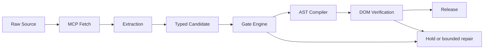

# Autonomous Multimodal Publishing Engine

**A case study in deterministic agent orchestration, typed data contracts, and layout compilation.**

Reliable generative publishing requires explicit boundaries between technical evidence, editorial language, and visual presentation. This architecture uses typed candidates, bounded execution, AST verification, and release gates to control those boundaries.

**Models Today** supplies the editorial setting: a publication about machine-learning systems, presented through fashion photography, typography, and magazine layouts. Technical systems are the subjects of analysis. Fashion personas are editorial assets. The distinction is central to the architecture.

The system is designed for autonomous composition with zero per-edition manual CSS/HTML adjustment. Harness validation gates autonomous operation.

## Case Study: Polysemy & Semantic Leakage in Agentic Pipelines

### The vulnerability: semantic cross-bleed

The word **model** refers to two different entities in this publication:

| Domain | Entity | Valid attributes |
|---|---|---|
| Technical analysis | Statistical foundation model or execution harness | Schema adherence, memory footprint, latency, reasoning evaluation, runtime limits |
| Editorial presentation | Fashion persona or visual asset | Wardrobe, pose, composition, lighting, approved asset revision |

An earlier README draft collapsed those meanings into the statement that foundation models **“share the visual language of a fashion magazine.”** That sentence assigned an aesthetic relationship to the technical entities being covered. The publication’s visual treatment had leaked into the description of its subject matter.

The corrected relationship is explicit: **the publication presents technical evaluations through an editorial layout.** The technical entity retains its benchmark attributes; the persona and template carry the visual treatment.

This is the polysemy failure mode: shared vocabulary lets generated language cross a domain boundary that the application needs to preserve.

### Root cause: overlapping vocabulary without explicit entity boundaries

A natural-language prompt can place benchmark data, persona descriptions, and art direction in the same context. Generation can then blend associations across those inputs. The observed sentence demonstrates the resulting semantic confusion; the architectural failure is the absence of an enforced distinction between the entity being analyzed and the medium presenting it.

Prompt wording alone cannot guarantee that distinction. Domain isolation requires explicit entity types, scoped worker inputs, and checks at each handoff.

### Mitigation: type the entities, separate the workers, constrain the predicates

**Explicit entity disambiguation.** `ModelBenchmarkPayload` carries technical identity and evaluation data. `EditorialAssetRef` carries an approved presentation asset. `PublicationCandidate` combines those references through named fields. A generic string called `model` cannot substitute for either entity.

**Boundary isolation.** Benchmark metadata travels through structured JSON and typed AST nodes. The Editorial Composition Engine receives the facts required for its writing task. Asset selection and template styling use separate inputs and permissions. Technical values enter trusted components through typed fields; generated copy has no authority to change metrics, asset approval, or layout code.

**Deterministic gate enforcement.** A finite metric vocabulary excludes aesthetic predicates from benchmark records. Unknown fields, wrong entity tags, and unresolved references block the candidate. An attempt to add `wardrobe`, `visual_style`, or a narrative field to a benchmark payload fails validation.

Free-form prose requires an additional semantic check. A string validator cannot establish every sentence’s meaning. Technical assertions therefore need typed subject and predicate references, evidence checks, and editorial assessment before release.

The following self-contained Pydantic v2 contract pattern demonstrates the entity boundary:

```python
from typing import Annotated, Literal
from pydantic import BaseModel, ConfigDict, Field

Identifier = Annotated[str, Field(min_length=1, max_length=128)]

class Contract(BaseModel):
    model_config = ConfigDict(
        strict=True, extra="forbid", allow_inf_nan=False
    )

class ModelBenchmarkPayload(Contract):
    entity_type: Literal["technical_benchmark"]
    subject_release_id: Identifier
    capability_class: Literal[
        "High-Fidelity Syntax Specialist",
        "High-Depth Foundation Class",
        "Compact Edge Inference Class",
        "Constrained Multimodal Synthesizer",
        "Stateful Execution Harness",
    ]
    metric: Literal[
        "schema_adherence_rate",
        "reasoning_task_accuracy",
        "peak_memory_mib",
        "latency_ms",
        "geometry_constraint_pass_rate",
        "timeout_compliance_rate",
    ]
    value: float = Field(ge=0)
    evidence_id: Identifier

class EditorialAssetRef(Contract):
    entity_type: Literal["editorial_asset"]
    asset_revision_id: Identifier
    role: Literal["hero", "fashion_persona", "product_detail"]

class PublicationCandidate(Contract):
    schema_version: Literal["entity-boundary-1.0"]
    run_id: Identifier
    benchmark: ModelBenchmarkPayload
    editorial_asset: EditorialAssetRef

# Export the contract for a structured worker handoff.
print(PublicationCandidate.model_json_schema())
```

This pattern defines the semantic boundary extension. The repository’s [publication contract](src/contracts/publication_candidate.py) implements the Sheet 01 candidate fields, strict validation, bounded lists, internal reference resolution, and revision hashing. Integration of the entity boundary belongs at the candidate and AST interfaces.

## The Engineering Harness



The architecture assigns responsibilities to three system roles:

| System role | Responsibility |
|---|---|
| Planning & Research Coordinator | Task formulation, source checks, scoped inputs, state transitions, and budget enforcement |
| Editorial Composition Engine | Structured synthesis and constrained copy generation |
| Gate Engine & Deterministic Auditor | Schema validation, AST verification, assertion checks, and release prerequisites |

Workers are selected by capability profile and evaluated against explicit criteria:

| Capability profile | Evaluation criteria |
|---|---|
| **High-Fidelity Syntax Specialist** | Schema adherence, grammar conformance, and zero layout drift in the defined evaluation corpus |
| **High-Depth Foundation Class** | Multi-hop reasoning, context retention, and depth of analysis against a recorded rubric |
| **Compact Edge Inference Class** | Memory footprint, execution speed, and parameter efficiency |
| **Constrained Multimodal Synthesizer** | Prompt-parameter adherence, bounding geometry, and visual fidelity |
| **Stateful Execution Harness** | Sandbox integrity, bounded retries, and execution timeouts |

Editorial writing is assigned to the High-Depth Foundation Class through the Editorial Composition Engine. Run records retain exact implementation identities and configurations for reproducibility.

### Sheet 01 · The Typed Contract


`PublicationCandidate` binds the run, subject release, generation parameters, evidence, claims, and content AST. Strict types and bounded collections constrain each handoff. Unknown fields are rejected; claim and evidence references must resolve.

Cryptographic hashing binds review to a specific candidate revision. The host resolves source IDs and snapshot SHA-256 values against its observation store, then checks asset revisions against its approval registry. Changing content invalidates approval for the previous revision.

A candidate’s confidence score carries no publication authority. Schema conformance is one gate in the release contract.

### Sheet 02 · Runtime Sequence


| Control | Runtime envelope |
|---|---|
| Shared run deadline | 180 seconds across stages and retries |
| Model-call cap | 3 total calls, including repair |
| Format-repair cap | 1 attempt |
| Source-fetch timeout | 10 seconds per attempt |
| Source-read retry cap | 1 retry |
| Input-token budget | 4,000 per call |
| Output-token budget | 1,200 per call |
| Aggregate token ceiling | 12,000 input and 3,600 output |

The Planning & Research Coordinator must reserve capacity before dispatch and cancel work at the shared deadline. A format repair consumes the same call and token allowances. Missing sources enter hold; unsupported assertions enter review. Every outcome is persisted with its revision and failure reason.

This envelope covers a small text update. Image synthesis and experiments require separately defined budgets.

### Sheet 03 · Quality Gates Matrix


> **Deterministic gates block release. Model judges advise; editors assess meaning and quality. No average cancels a failed critical gate.**

| Gate | Release criterion |
|---|---|
| Contract | Required fields, strict types, bounds, and internal references pass |
| Domain isolation | Entity tags and permitted predicates preserve technical and editorial boundaries |
| Grounding | Material assertions resolve to relevant evidence and accountable review |
| AST verification | Allowed typed nodes only; no executable or dangling nodes |
| DOM geometry checks | No essential overflow or collision; 1 CSS px rounding tolerance, declared scroll regions excepted |
| Access and budget | Valid revision approval, enforced permissions, and available capacity |
| Fidelity and voice | Approved assets; each release rubric dimension ≥ 4/5; editor acceptance during the pilot |
| Idempotent release | One logical release per event; duplicate and restore fixtures pass |

A high editorial score cannot override a failed schema, evidence, permission, or geometry check. Semantic leakage is addressed both at the typed boundary and during assertion review.

### Sheet 04 · Trust Boundaries


The topology separates the local sovereign workspace, external inference APIs, and public delivery. Workers receive scoped context and no publication credentials. A separate release service checks the approved revision and export policy before using its credentials.

MCP adapters enforce source destinations, redirect rules, response limits, and quarantine. Retrieved text remains untrusted input. The inference gate selects approved fields and destinations for outbound requests; the release gate exports only the reviewed publication package.

Offline execution uses staged sources and local weights with network crossings disabled. Connected execution routes each crossing through policy and logs. These boundaries support the access controls and auditability required in regulated enterprise data environments and production platform standards.

## Compiled Artifacts & Design Study

The three design studies establish the compiler’s visual acceptance standard. Typed JSON maps to trusted components: narrative blocks occupy a two-column grid, callouts occupy bounded slots, product metadata occupies a reserved sidebar, and directory records follow a consistent row structure. Templates own CSS and HTML.

A compiled release must pair its rendered artifact with the accepted payload, compiler revision, approved assets, pinned browser and fonts, and passing DOM geometry checks. This evidence establishes collision-free output for the recorded rendering conditions.

### The Daily Ledger


A directory layout for capability profiles, technical records, and execution harnesses. Structured records supply the taxonomy; the editorial template controls typography, spacing, and navigation. Technical identity remains attached to evidence throughout rendering.

### Off-duty. On-device.


The editorial grid separates the narrative column from the product metadata rail. Approved asset references carry photography and styling. Technical assertions enter the narrative through evidence-linked claims, preserving the distinction between an analyzed system and a depicted persona.

### Jev. Decision Time.


The feature layout combines a dominant hero with structured supporting callouts. Template constraints define headline placement, contrast, reading order, and component separation. The supplied spread title identifies the design artifact.

## Core Takeaways for Systems Architects

1. **Disambiguate entities before generation.** Shared vocabulary is a reason to introduce explicit types, identifiers, and permitted predicates.
2. **Separate evidence from presentation.** Technical metadata, editorial copy, and visual assets need distinct paths and authority.
3. **Constrain the renderer.** Typed AST nodes select trusted components; templates control layout and executable markup.
4. **Enforce gates independently.** Contract validity, semantic support, visual geometry, and release permission answer different questions. Each critical gate must pass.
5. **Bind release to a revision.** Approval, hashes, bounded retries, and idempotent release keep generation from acquiring publication authority.

The result is an architecture in which autonomous generation operates inside explicit contracts, measurable budgets, and inspectable release decisions.

## Implementation & Specifications

- [Publication contract](src/contracts/publication_candidate.py): Pydantic v2 candidate validation and revision hashing.
- [Contract tests](tests/test_publication_candidate.py): synthetic acceptance, rejection, reference, and hash checks.
- [Architecture companion](docs/architecture/ARCHITECTURE.md): runtime, rendering, recovery, and trust-boundary requirements.
- [Concept brief](docs/specs/01_CONCEPT_BRIEF.md) and [business requirements](docs/specs/02_BUSINESS_REQUIREMENTS.md): editorial scope and acceptance criteria.

With Python 3.11+ and the [pinned dependency](requirements.txt) installed:

```sh
python -m unittest discover -s tests -v
```
