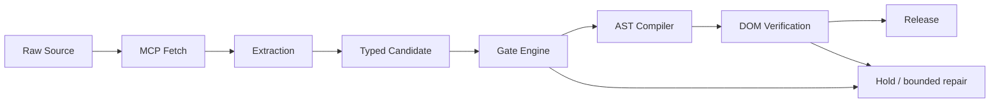
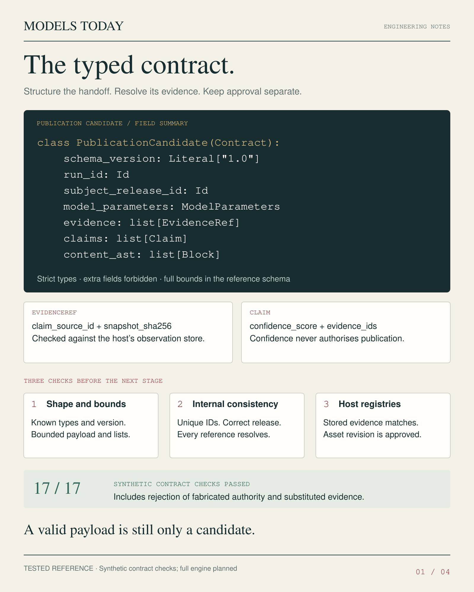
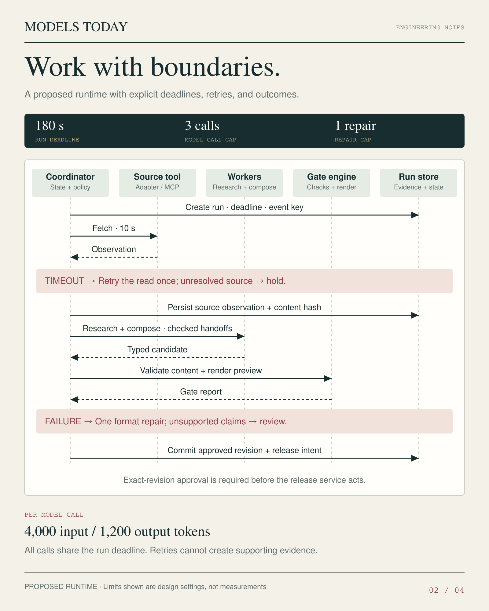
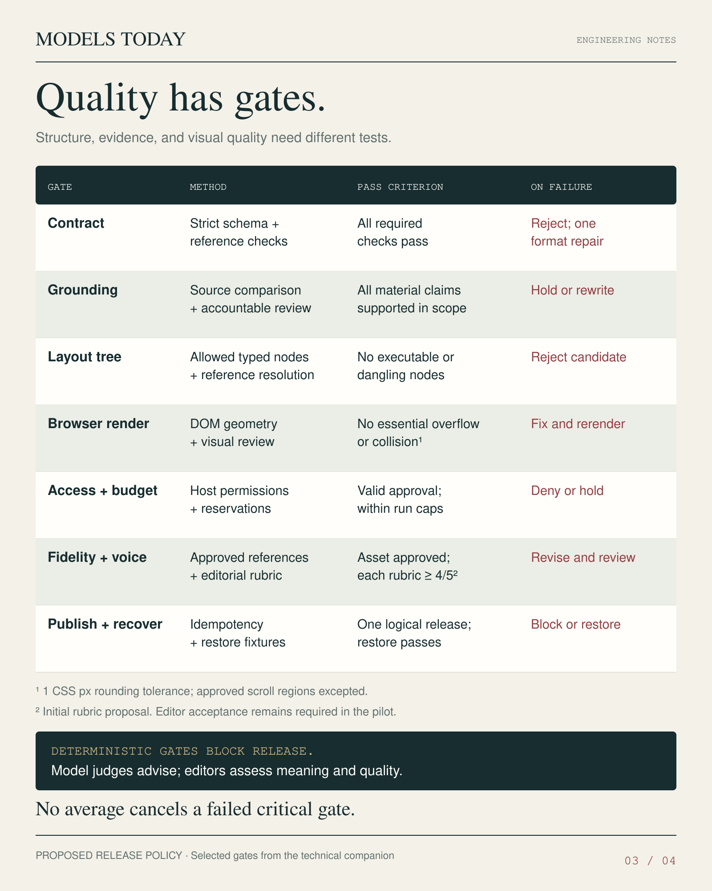
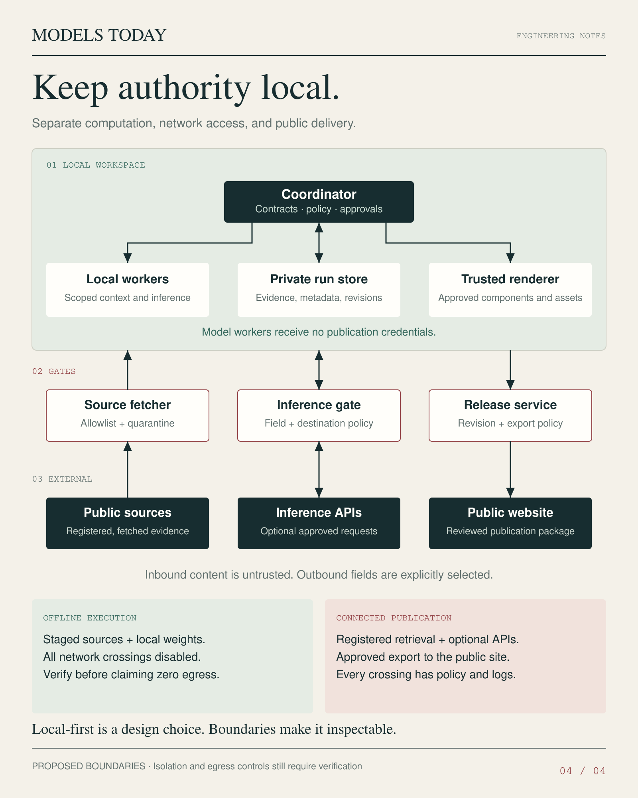

# Autonomous Multimodal Publishing Engine

**A Case Study in Deterministic Agentic Systems**

Unconstrained language-model output cannot guarantee a stable editorial layout. This project places generation inside typed data contracts, bounded runtimes, and deterministic quality gates. Models propose content; trusted code controls structure, rendering, and release authority.

The test case is **Models Today**: a tongue-in-cheek editorial publication where model parameters meet runway specifications and outdoor gear. Qwen, Gemma, Llama, and FLUX share the visual language of a fashion magazine. The system is designed for autonomous composition into print-grade layouts with zero per-edition manual CSS/HTML adjustment. Harness validation gates autonomous operation.

**Writing model:** the architecture assigns editorial writing to a GPT-6-family model, with its exact identity and configuration recorded per run. Local models are subjects of coverage and optional workers. Editorial writing passes through the approved external-inference boundary.

## Architecture overview



The harness defines this success path. Every transition records its input revision and outcome. Release additionally requires exact-revision approval; a model response cannot authorize it. Determinism applies to validation, trusted transformations, and replay of accepted artifacts under pinned dependencies. Fresh inference and mutable source retrieval remain variable.

## Phase I: The engineering harness

### 01 · The typed contract



`PublicationCandidate` keeps content separate from authority. Strict types reject coercible but invalid values; unknown fields are forbidden. Evidence references carry a source ID and snapshot SHA-256. Claims name the subject release and their supporting evidence. AST verification starts with a bounded vocabulary of typed blocks and resolved references.

The following Pydantic v2 example is copy-pasteable from the repository root with `requirements.txt` installed. It uses the [complete contract](src/contracts/publication_candidate.py), whose seven candidate fields match Sheet 01. The source defines the nested types, bounds, reference checks, and revision hash.

```python
from src.contracts.publication_candidate import PublicationCandidate, candidate_sha256

candidate = PublicationCandidate.model_validate({
    "schema_version": "1.0",
    "run_id": "fixture-run-001",
    "subject_release_id": "example-release-001",
    "model_parameters": {
        "model_id": "fixture-worker",
        "temperature": 0.0,
        "max_output_tokens": 1200,
    },
    "evidence": [{
        "claim_source_id": "source-001",
        "snapshot_sha256": "0" * 64,  # Synthetic placeholder, not verified evidence.
    }],
    "claims": [{
        "claim_id": "claim-001",
        "subject_release_id": "example-release-001",
        "text": "This is an illustrative record.",
        "confidence_score": 0.5,
        "evidence_ids": ["source-001"],
    }],
    "content_ast": [{
        "node_id": "paragraph-001",
        "kind": "paragraph",
        "text": "This is an illustrative record.",
        "claim_ids": ["claim-001"],
    }],
})
print(candidate_sha256(candidate))
print(PublicationCandidate.model_json_schema()["required"])
```

The host must resolve each source/hash pair against its observation store, confirm asset revisions, and assess claim support. Confidence never grants approval.

Strict validation and unknown-field rejection use documented [Pydantic model configuration](https://pydantic.dev/docs/validation/latest/concepts/models/) and [strict mode](https://pydantic.dev/docs/validation/latest/concepts/strict_mode/).

### 02 · Runtime sequence



The coordinator design separates research and composition into bounded workers. Its envelope is explicit:

| Control | Design setting |
|---|---|
| Run deadline | 180 seconds shared by all stages and retries |
| Model calls | At most 3 total, including any repair |
| Format repair | At most 1; no repair loop for unsupported claims |
| Source fetch | 10 seconds per attempt; at most 1 read retry |
| Input allowance | At most 4,000 tokens per model call |
| Output allowance | At most 1,200 tokens per model call |
| Aggregate ceiling | 12,000 input and 3,600 output tokens across 3 calls |

This envelope governs a small text update. The coordinator must reserve capacity before dispatch, cancel work at the shared deadline, and persist failures. An unresolved source enters hold; unsupported claims enter review. A retry cannot manufacture evidence.

### 03 · Quality gates matrix



> **Deterministic gates block release. Model judges advise; editors assess meaning and quality. No average cancels a failed critical gate.**

| Gate | Required acceptance evidence |
|---|---|
| Contract | Required fields, strict types, bounds, and references pass |
| Grounding | Every material claim has relevant support and accountable review |
| AST layout tree | Allowed nodes only; no executable or dangling nodes |
| DOM geometry checks | No essential overflow or collision; 1 CSS px rounding tolerance, declared scroll regions excepted |
| Access and budget | Exact-revision approval, enforced permissions, reserved capacity within caps |
| Fidelity and voice | Approved assets; each release rubric dimension ≥ 4/5; editor acceptance in the pilot |
| Idempotent release | One logical release per event; duplicate and restore fixtures pass |

Schema validation cannot establish truth, visual quality, or operational isolation. The [architecture companion](docs/architecture/ARCHITECTURE.md) defines enforcement and acceptance requirements.

### 04 · Trust boundaries



The topology separates local sovereign compute, optional external inference APIs, and public export. The coordinator holds policy; workers receive scoped context and no publication credentials. Source retrieval, inference requests, and releases each cross a distinct host-controlled gate.

## Phase II: The compiled output — design studies

The target compiler maps typed JSON to trusted components: ordered narrative blocks into a two-column grid, `callout` blocks into bounded boxes, `product_sidebar` blocks into a reserved metadata rail, and `ledger_row` blocks into a consistent directory. Templates own CSS and HTML; worker payloads supply content and approved asset references.

The three editorial studies define the output standard: expressive typography, disciplined grids, readable callouts, and integrated product metadata.

### Off-duty. On-device.


The layout benchmark combines a wide hero with narrative and product columns. Compilation must reserve the sidebar width and reject content that clips essential text at supported viewports.

### Jev. Decision Time.


A hero-led feature direction with three supporting editorial callouts. The target template must preserve headline contrast, reading order, and separation between the hero and supporting content.

### The Daily Ledger.


The directory groups model families and harnesses into a regular grid. Production records resolve to exact releases and supporting evidence. FLUX appears as an image-model family.

The release contract ties each compiled spread to its typed input, approved assets, compiler revision, pinned fonts/browser, gate report, rendered DOM, screenshot, and intervention log. Print-grade acceptance adds page-size, font, resolution, and print/export checks.

## Security & sovereign isolation

Workers propose candidates without deployment keys or publication sessions. A separate release service validates the approved revision digest and export policy before using its credentials. Editing a candidate invalidates that approval.

Inbound sources are untrusted data. MCP adapters must enforce destination allowlists, redirect and response limits, quarantine, and host permissions. Source text cannot change tool authority. Outbound inference sends only approved fields to approved destinations; public export contains only the reviewed publication package. Private run-store contents stay behind the boundary.

Offline operation requires staged sources, local weights, and disabled network crossings. Connected operation requires logged, policy-controlled retrieval, inference, and export. Network-denial tests and transfer logs form part of isolation acceptance.

## Repository guide

| Path | Purpose |
|---|---|
| `assets/` | All seven original PNGs under stable showcase names |
| [Concept brief](docs/specs/01_CONCEPT_BRIEF.md) | Public editorial and product baseline |
| [Business requirements](docs/specs/02_BUSINESS_REQUIREMENTS.md) | Requirements, milestones, and acceptance criteria |
| [Architecture](docs/architecture/ARCHITECTURE.md) | Contract semantics, state transitions, gates, and trust boundaries |
| [Contract source](src/contracts/publication_candidate.py) | Pydantic v2 implementation of Sheet 01’s field summary |
| [Contract tests](tests/test_publication_candidate.py) | Synthetic acceptance/rejection and hash checks |

With Python 3.11+ and the pinned dependency available, run from the repository root:

```sh
python -m unittest discover -s tests -v
```

The implementation path begins with one source-to-preview slice, then adds recovery fixtures and controlled release before enabling autonomous operation.
