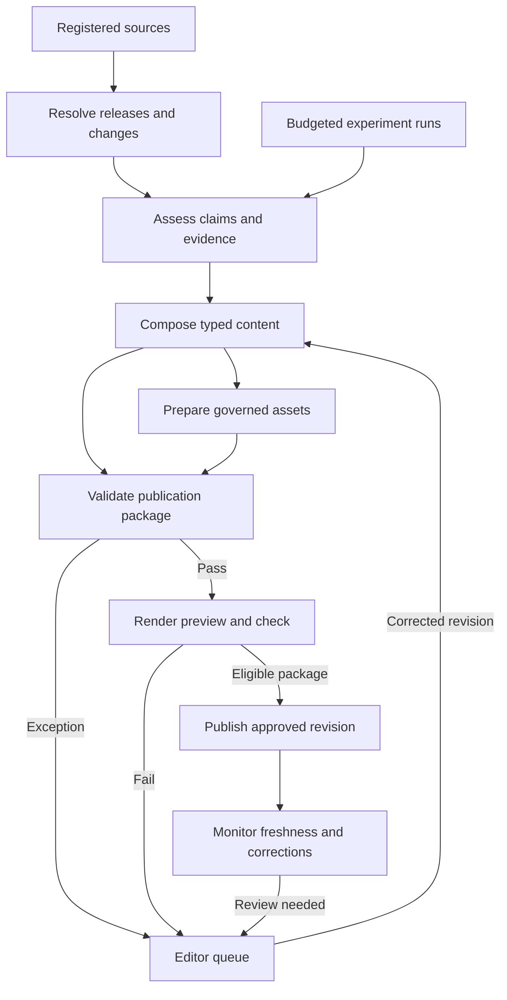

# Models Today Magazine

**Implementation direction — 28 September 2026:** The architecture assigns editorial writing to a GPT-6-family model, with exact model selection following harness completion. The acceptance criteria below govern autonomous operation. Local-only writing requires a separately evaluated writer.

**Document:** Business Requirements Document  
**Maintainer:** Andrew M. Ihnativ  
**Status:** Approved Engineering Baseline  
**Version:** 1.2  
**Date:** 28 September 2026  
**Companion:** [Concept & Editorial Operating Brief, version 1.3](01_CONCEPT_BRIEF.md).

Baseline approval applies to the requirements and acceptance criteria. It does not establish that the specified system, evaluations, or original experiments are complete. Capability status shall be supported by implementation and validation evidence.

**Technical assets:** The [architecture companion](../architecture/ARCHITECTURE.md) explains the four engineering sheets: typed contract, runtime sequence, quality gate matrix, and trust boundaries. The repository includes a Pydantic candidate contract and synthetic tests. Runtime limits define the intended envelope for a small text update.

**Revision 1.2:** Establishes the public engineering baseline with standardized ownership metadata, general application contexts, and formal product and engineering language. Functional requirements, release gates, workflow dependencies, and validation semantics are retained.

The concept defines the publication’s identity and editorial principles. This BRD defines outcomes, scope, requirements, acceptance evidence, and delivery gates. Implementation decisions should be recorded separately as architecture decision records. When a material requirement changes, update this baseline and its acceptance criteria together.

## 1. Business purpose

Models Today will help professional and hobbyist AI engineers discover consequential individual model and harness releases, understand their practical strengths and limitations, and use them well in work and life. It combines a continuously refreshed technical ledger with the visual confidence, pleasure, and cultural range of a fashion magazine.

There are two explicit outcomes:

| Outcome | Value | Evidence of progress |
|---|---|---|
| **A useful publication** | Readers can find suitable releases, inspect evidence, learn useful practices, and enjoy distinctive editorial work. | Reader task completion, return visits, use of comparisons and methods, qualitative feedback, freshness, corrections, and sustainable editorial effort. |
| **An inspectable engineering reference** | Provide a reproducible demonstration of the design, implementation, evaluation, and operation of AI workflows and discovery tools. | Working code, architecture decisions, contracts, execution traces, measured evaluations, recovery demonstrations, and documented contributions and limitations. |

The two outcomes have separate scorecards. Reader traction does not prove operational reliability; passing an evaluation suite does not prove that readers want the publication.

**Engineering description:** “An evidence-backed discovery and publishing system with schema-constrained agent workflows.” A later implementation can legitimately demonstrate multi-agent orchestration when bounded specialist agents are actually present and their contribution is measured. Determinism applies to defined parts of the system, not to every generated or externally retrieved output.

## 2. Users, responsibilities, and decisions

| Participant | Need or responsibility |
|---|---|
| Professional or hobbyist AI engineer | Discover exact releases, filter by practical constraints, inspect evidence, and reproduce useful experiments. |
| IT or data leader | Understand a deployment’s documented controls, limitations, lifecycle, and suitability for a stated organisational scenario. |
| Life & Style / culture reader | Enjoy polished imagery, believable interactions, thoughtful writing, fiction, poetry, and useful objects. |
| Accountable editor | Set coverage, sources, budgets, editorial policy, identity standards, and release criteria; resolve exceptions and approve increasing autonomy. |
| Maintainer / operator | Implement contracts, access controls, evaluation, recovery, instrumentation, and maintenance. Responsibilities may be assigned to one or more contributors. |
| Technical reviewer or open-source contributor | Inspect evidence of what was built, why decisions were made, how failures are handled, and what remains unproven. |

The maintainer shall curate the initial source candidates. The implementation must accommodate a small curated register before broader scanning. Recurring jobs, cloud expenditure, external publication, and commercial arrangements require the applicable operational policy and release conditions.

## 3. Scope and priorities

**Must** means required for the reader pilot, unless a requirement explicitly names the engineering milestone. **Should** means valuable and deferrable with a recorded reason. **Later** means outside the initial pilot. These priorities define baseline commitments; completion is determined by the applicable acceptance evidence.

| Initial pilot scope | Boundary |
|---|---|
| Responsive magazine and Daily Ledger | Cover/home, exact-release directory and detail pages, comparison or experiment page, feature/guide, Life & Style, and culture templates. |
| Deliberate coverage | Approximately 20–30 individual model and harness releases, selected for useful coverage rather than comprehensiveness. Family names support grouping. |
| Evidence and discovery | Hot/upcoming views; task capability, safety/reliability, and enterprise-readiness evidence with explicit scope and missing information. |
| Choreographed production | Registered sources, durable runs, validated records, a review queue, publication revisions, and visible freshness. |
| Editorial identity | Two or three original adult personas grounded in southern BC and the PNW; a few governed Patagonia candidates and computing objects. |
| Experimental content | External-experiment coverage immediately; a small original experiment when budget and environment permit. An actual original run is required before claiming original experimental capability in the engineering reference. |
| Commerce | Optional outbound retailer links; affiliate links only where the applicable arrangement exists. |

**Outside the initial pilot:** inventory, checkout, merchant/payment handling, fulfilment, open user submissions, social networking, a universal model leaderboard, general safety certification, exhaustive monitoring, unrestricted agents, a custom rendering language, and a distributed platform built solely for presentation value. GCP is an available future execution environment, not a mandatory first deployment.

## 4. Functional requirements

The acceptance examples below become executable tests or recorded editorial checks during implementation. Passing means passing the stated scope; it is never a claim of universal correctness.

### Source, ledger, and discovery requirements

| ID / priority | Requirement | Acceptance evidence |
|---|---|---|
| **L01 · Must** | Maintain a source register with owner, URL, scope, access method, reuse basis, cadence, and last attempted/successful retrieval. Accept maintainer-curated sources and manual entries. | A permitted source can be registered, refreshed, disabled, and inspected. A failed refresh preserves the last successful check; it cannot mark the source current. |
| **L02 · Must** | Identify individual releases using official IDs and available versions/revisions. Record variants, aliases, deployment endpoints, and harness release/commit separately. | A fixture containing two releases from one family creates distinct records. A mutable hosted alias carries an observation date and reproducibility limitation. Ambiguous identity is held for resolution. |
| **L03 · Must** | Attach material technical claims to specific evidence, source dates, observation times, and the relevant entity/configuration. Preserve disagreements and unknowns. | A claim can be traced to its supporting item and scope. A fabricated claim with a syntactically valid citation ID fails semantic review when the cited item does not support it. |
| **L04 · Must** | Preserve dated lifecycle events and revisions: announcement, preview, availability, change, supersession, deprecation, withdrawal, and correction as applicable. | Reingesting an event creates no duplicate. Withdrawal changes current status without erasing history; dependent editorial selections are flagged for reassessment. |
| **L05 · Must** | Provide hot today/week/month and upcoming views with reasons and time windows. Present capability, safety, and enterprise evidence as scoped assessments. | Each selected row links to an exact release and basis for inclusion. An unassessed control displays “not assessed”; a hosted-plan capability is not inherited by every deployment of the model. |
| **L06 · Must** | Support text search and deterministic facets for entity type, task/modality, access route, lifecycle, and available hardware/deployment constraints. Distinguish declared from tested requirements. | A fixed query set verifies filtering, combinations, counts, empty states, and unknown values. An “unknown memory requirement” record is not silently treated as fitting an 8 GB limit. |
| **L07 · Should** | Compare selected releases by comparable evidence and show why each result matched a discovery query. Support evidence-linked readiness criteria, not a universal score. | Comparison preserves units, conditions, missing values, and source labels. Search result explanations point to actual fields. Semantic retrieval is evaluated against this baseline before adoption. |

### Editorial, visual, and commercial requirements

| ID / priority | Requirement | Acceptance evidence |
|---|---|---|
| **P01 · Must** | Publish distinct formats for the Daily Ledger, The Edit, Test Bench, Field Notes, Life & Style, Point of View, and Salon using reusable components. Preserve the polished, playful, entertaining, non-sarcastic voice. | A sample edition exercises the principal page types; the editor records a voice and usefulness review. Navigation allows direct entry to technical records. |
| **P02 · Must** | Label provider claims, external experiments, original experiments, replication/reanalysis, commentary, and editorial selections. Preserve attribution and human editorial responsibility. | A Mollick experiment can be recorded as external evidence with known methods and limitations. Summarising it cannot relabel it as a Models Today run. Commentary from Bremmer or Thompson retains its actual author and source. |
| **P03 · Must** | Maintain versioned persona, wardrobe, object, scene, and approved-asset records. Track visual specification separately from permission/reuse basis. | A published scene resolves its persona version and named products, caption, alt text, provenance, and approval. A missing required record blocks that scene’s release. |
| **P04 · Must** | Use typed content blocks and an approved design system; render factual text, tables, charts, and navigation through code. Inspect responsive output and visual fidelity. | Long titles, absent optional images, wide comparisons, and mobile crops have tested outcomes. Generated image text is not the sole representation of factual information. |
| **P05 · Should** | Offer restrained product modules for clothing, hardware, software, accessories, fragrances, or other suitable objects. Keep commercial influence separate from rankings. | The destination retailer and relationship are clear. Ordinary links remain usable without an affiliate agreement; commission language appears only when accurate. No Models Today checkout or order processing is introduced. |

Life & Style scenes should include natural conversation and varied poses, with believable spacing and supported objects. Drinks should be placed away from computers. Named-product depictions require fidelity review; the Patagonia candidates in the concept remain candidates, not proof of permission or affiliation. The concept’s visual and usage rules remain part of P03 acceptance.

### Workflow and engineering requirements

| ID / priority | Requirement | Acceptance evidence |
|---|---|---|
| **E01 · Must** | Persist each run and step with identity, dependency, status, attempts, timestamps, input/output references, and errors. Support resume and cancellation. | After a forced stop, completed steps remain inspectable and restart does not rerun completed side effects. Cancelled work cannot later publish through an abandoned worker. |
| **E02 · Must** | Version and validate every external/model input and inter-stage handoff. Reject unknown fields where appropriate; normalisation/coercion must be explicit. | Contract fixtures cover malformed data, wrong units/types, incompatible schema versions, missing IDs, and unsupported block types. Errors route to a named recovery or review path. |
| **E03 · Must** | Enforce idempotent ingestion and publication, bounded retries, timeouts, concurrency, and per-run resource limits. | Duplicate triggers yield one event and one logical publication revision. A transient outage exhausts its retry limit and stops. An uncertain write outcome is checked before retrying. |
| **E04 · Must** | Separate generation from publication authority. Permit release only from an approved or policy-eligible package; retain revision history and rollback. | A worker cannot publish directly. A content edit invalidates approval of the old package. An interrupted publish exposes either the old or complete new revision; rollback restores the earlier approved version. |
| **E05 · Must** | Record inspectable, redacted traces and manifests: sources, code/configuration, models, prompts, schemas, templates, assets, interventions, durations, and cost basis. | A publication ID resolves to its accepted inputs and run. Export omits secrets and restricted source material while retaining allowed provenance. Missing cost telemetry is labelled, not recorded as zero. |
| **E06 · Must** | Maintain a regression and evaluation suite for contracts, evidence handling, discovery, workflow recovery, and rendering. Re-run affected tests on changes to code, adapters, models, prompts, or templates. | CI or an equivalent repeatable runner emits a versioned report with dataset, counts, failures, and release decision. A deliberately introduced critical regression blocks promotion. |
| **E07 · Should** | Demonstrate bounded specialist collaboration where it improves the workflow: research/evidence extraction, editorial composition, and optional visual-brief synthesis. Keep tools and budgets role-specific. | A recorded run shows actual handoffs and a rejected output. Compare the selected design with a simpler baseline for quality, latency, cost, and maintenance. Explain retained complexity; do not call a deterministic function an autonomous agent. |
| **E08 · Should** | Expose useful read-only MCP access to exact-release records, evidence, or run status when an external client needs it. Publication and paid-job execution remain separately controlled. | A supported client completes a real retrieval task; unauthorised access is denied by application/host controls. A protocol annotation cannot grant a permission. Document the integration’s actual benefit. |

### Experiments and operations

| ID / priority | Requirement | Acceptance evidence |
|---|---|---|
| **X01 · Must for original results** | Run experiments from a versioned protocol with exact configurations, workload provenance, repetitions, measurements, scoring, artifact retention, and budget. | A published original finding resolves to actual raw run records and analysis. A failed or cancelled run remains in the record. No illustrative value is presented as measured. |
| **X02 · Should** | Support local execution first where suitable; add hosted APIs, GCP, or other environments behind the same experiment contract. | Results distinguish environment and timing boundaries. Cloud jobs have explicit limits and cleanup evidence. Cross-environment comparisons state material differences. |
| **O01 · Must** | Treat source content as untrusted; enforce tool/network/file access boundaries outside prompts. Isolate execution, validate destinations, and keep credentials outside generated content. | A malicious source cannot grant tool access, trigger publication, read secrets, or redirect retrieval into a prohibited destination in the defined adversarial suite. Redaction checks cover logs and exports. |
| **O02 · Must** | Support an editor queue with reason, evidence, proposed action, approval history, and policy version. Make stale and incomplete data visible to readers. | The editor can hold, reject, correct, or approve a package. A failed source refresh produces an operator-visible exception and an accurate public verification time. |
| **O03 · Must** | Keep a portable export and recoverable backup of canonical records, publication revisions, and permitted assets; document retention and restore. | Restore a pilot snapshot into a clean workspace and reproduce a chosen accepted publication from stored inputs. Any exclusions are listed. |
| **O04 · Must** | Measure operating effort, elapsed time, failure rates, and expenditure. Keep reader analytics proportionate and avoid collecting unnecessary personal data. | A pilot report separates editor time, generation/compute cost, known billing, estimates, and missing telemetry. Reader analytics have a documented purpose and retention rule. |

## 5. Information model and traceability

These are conceptual contracts, not a prescribed database schema.

| Entity | Essential relationships and distinctions |
|---|---|
| **Source / Source observation** | Stable registered source; dated retrieval attempt and successful observation; permitted snapshot or excerpt where available. |
| **Model release / Harness release / Deployment** | Family grouping separate from exact identity. Deployment stores endpoint, plan, runtime, or hardware context without changing the model’s intrinsic identity. |
| **Claim / Evidence item / Assessment** | Claim links to supporting or conflicting evidence. Assessment records scope, evaluator, method, date, conclusion, and limitations. |
| **Lifecycle event / Editorial selection** | A dated change is separate from the editor’s reason for recommending or watching a release. |
| **Experiment protocol / Run / Analysis** | Planned method, actual execution, and interpretation remain separate; each original result has underlying run IDs. |
| **Persona / Product or object / Asset / Scene** | Approved identity and product revisions resolve to each published appearance and its usage record. |
| **Article / Edition / Publication revision** | Typed content references evidence and approved assets. Revision captures the exact released package. |
| **Workflow run / Step attempt / Approval** | Links code, policies, inputs, outputs, costs, failures, and human interventions to the result. |

Every stored contract includes a schema version and stable ID. Times use an explicit timezone. Measurements carry units; money carries currency and a measurement/estimate label. Model or runtime revision fields can be unknown when unavailable; uncertainty must not be replaced with an invented value.

The key inspection path is: **published assertion → claim → evidence or experiment → exact release/configuration → dated observation/run**. For presentation: **published scene → asset approval → persona/product revisions → provenance and permitted-use record**. Changes to upstream evidence or assets flag affected downstream content for reassessment.

## 6. Workflow and control boundaries

The following diagram shows proposed data dependencies. A durable coordinator manages execution, retries, timeouts, and review states around these dependencies.

The forward dependencies may be represented as a DAG. Retries, corrections, and review loops belong to the surrounding state machine; calling the whole lifecycle a DAG would hide these behaviours. Experiment proposals do not start paid jobs until a protocol and budget are authorised under configured policy.

Use distinct step execution states such as pending, running, succeeded, retryable failure, terminal failure, and cancelled. Content additionally has draft, held, approved, scheduled, published, and superseded states. Do not use a single “success” flag for both execution and editorial approval. Publication permission is evaluated against the exact content revision, current policy, and required checks.

Initially one process and durable store can own these transitions. Add worker leases, queues, and distributed coordination only when concurrent execution or recovery requirements demand them. Even with one worker, record idempotency keys and check side-effect outcomes. Do not claim exactly-once delivery across external services; demonstrate one logical publication through deduplication and reconciliation.

## 7. What validation and determinism mean

| Control | What it can establish | What still needs separate evidence |
|---|---|---|
| **Schema/type validation** | Accepted structures conform to declared types and constraints. | Factual truth, adequacy of a citation, visual quality, and safety of an action. |
| **Semantic/domain checks** | IDs exist, units and dates are consistent, references resolve, and required evidence fields are present. | Whether a source actually supports a nuanced conclusion; use a rubric and accountable review. |
| **Policy enforcement** | A requested action meets encoded permissions, tool scope, approval, and resource limits. | Universal resistance to every attack; tests define observed coverage. |
| **Typed composition and rendering** | Approved blocks map to approved components; required assets and fallbacks resolve. | Responsiveness and appearance across supported browsers; test actual output. |
| **Replay of accepted artifacts** | The same stored accepted inputs and pinned transformations produce the expected publication structure. | Identical fresh model responses or identical pixels across arbitrary environments. |

Pydantic’s documented validation guarantees concern output types and constraints.[1] The project therefore treats schema conformance as one layer. JSON Schema can describe required fields and constrain additional properties; the acceptance meaning of those fields remains a domain responsibility.[2]

Pin code, schemas, templates, fonts, and relevant rendering dependencies for fixture replay. Compare canonical content and asset hashes; exclude declared volatile metadata such as a new replay timestamp. Pixel comparisons use a pinned browser/environment and an explicitly chosen tolerance. Call a new fetch or new generation a **live rerun**, with its own run ID.

The proposed publisher accepts a restricted content tree mapped to trusted components. If an AST is implemented, document its node types and validation. Arbitrary generated code execution is unnecessary for the pilot. Prompt constraints, negative prompts, forbidden-token filters, and model-based reviewers may assist quality; none replaces permission enforcement or inspection.

## 8. Evaluation and release gates

Maintain three separate evidence streams:

1. **System evaluations:** Does our scanner, matching, agent workflow, renderer, and recovery behave as intended?
2. **Editorial experiments:** How does an exact model/harness/configuration perform on a stated workload?
3. **Product research:** Can readers find, interpret, and use the information, and do they return?

Start with a small, versioned fixture corpus containing the cases below. Record expected outcomes and review labels before using it to accept a candidate. Keep a separate challenge set as coverage grows so tuning does not simply memorise acceptance examples.

| Gate | Required demonstration | Requirements supported |
|---|---|---|
| **G01 · Traceability** | Inspect a complete live source-to-publication path plus a repeatable fixture path. Each sampled technical assertion resolves to relevant evidence. | L01–L03, E05 |
| **G02 · Identity and change** | Correctly handle two similar releases, a mutable alias, a duplicate event, and a withdrawal. Unknown identity enters review. | L02, L04, L05 |
| **G03 · Invalid content** | Reject malformed handoffs, unknown blocks, inconsistent units, absent evidence, and a valid-looking citation that does not support the claim. | L03, E02, E06 |
| **G04 · Recovery** | Force a source outage, worker interruption, duplicate trigger, and uncertain publication outcome. Demonstrate bounded attempts, resume, and no duplicate logical publication. | E01, E03, E04, O02 |
| **G05 · Permissions** | Exercise source prompt injection, an unauthorised tool request, a prohibited fetch destination, and a secret-like test value. Record denied actions and redacted output. | E04, O01 |
| **G06 · Rendering and assets** | Check long and missing content, a missing optional asset fallback, a missing required asset block, persona/product revisions, and narrow layouts. | P03, P04 |
| **G07 · Discovery** | Complete representative queries for an individual release, local hardware constraints, upcoming harnesses, and deployment evidence. Measure correctness and task completion. | L05–L07 |
| **G08 · Revision and restore** | Edit after approval, prove reapproval is required, publish, roll back, and restore a saved revision in a clean workspace. | E04, O03 |
| **G09 · Generative regression** | Compare a candidate prompt/model with the recorded baseline on factual support, task completion, editorial rubric, latency, and cost. Record all failures and review decisions. | P01, P02, E06, E07 |
| **G10 · Original experiment** | Execute a budgeted protocol; retain raw records and analysis, including failures; reproduce at least one reported aggregate from those records. | X01, X02 |

For deterministic contract, permission, duplicate, and publication checks, all designated critical fixtures must pass before release. An unsupported material assertion or unapproved named-product asset in a reviewed publication package blocks that package. Zero failures in a defined test suite is reported with the suite’s size and scope; it is not advertised as zero real-world risk.

For generative quality, define the rubric, minimum acceptable score, sample size, and tolerated regression before promoting a candidate. A model-based judge may assist triage; calibrate it against human review and retain disagreements. If a provider changes behind an alias, retain the observation date and rerun the relevant evaluation; do not silently treat old results as current.

## 9. Original experiments and speed tests

Select one useful question and a feasible environment first. A suitable first study is an exploratory responsiveness comparison of a small number of exact releases on a fixed task set with a correctness criterion. The result may be inconclusive and still be publishable.

The protocol records model/harness identities, hardware/runtime, endpoint and region, precision, workload provenance, input/output lengths, generation settings, warm-up and cache state, concurrency, repetitions, timeout policy, measurement boundaries, and scoring. Preserve requests, permitted outputs, raw timings, failures, and analysis code.

Report separately:

- **Time to first token**, when streaming is available, with its client-observed boundary defined.
- **Generation rate**, with token counting and tokenizer differences disclosed.
- **End-to-end completion or time to a correct result**, including relevant tools and retries.
- **Successful throughput under stated load**, plus failures and latency distributions when adequately sampled.
- **Observed cost and resource use**, separating billing from estimates and original currency from any stated CAD conversion.

Decision systems such as the proposed Jev coverage may call for request latency and decision throughput rather than token-generation measures. Choose metrics from the actual interface and reader task. Avoid tail-percentile claims from a tiny sample, and avoid comparing local and hosted measurements as equivalent when conditions differ.

Local, GCP, API, and other execution backends can share the same run contract. Each paid job needs a spending allowance, timeout, retry cap, and cleanup plan. Publication waits for real artifacts and review. A daily source scan does not imply a daily expensive benchmark.

## 10. Quality, service, and operating objectives

| Area | Proposed pilot objective and measurement |
|---|---|
| Freshness | Attempt a daily check of enabled daily sources. Show last successful verification and flag records whose configured freshness window has elapsed. Record attempted versus successful coverage. |
| Reliability | Pass the critical gates above; retain last known good content during failed refreshes. Measure actual successful scheduled runs before setting a service-level objective. |
| Accessibility | Keyboard operation, visible focus, logical reading order, descriptive links, alt text, readable contrast, and factual content available as text. Record automated and manual checks; do not claim full conformance from a scanner alone. |
| Responsive layout | Review agreed templates at 360, 768, and 1440 CSS-pixel widths plus representative mobile/desktop browsers. No unintended page-wide overflow, obscured controls, or clipped essential text in the reviewed corpus. Wide tables may have an intentional labelled scroll region. |
| Performance | Record publication duration, search latency, page loading behaviour, payload sizes, and generation time on a stated environment. Set and document numerical budgets before public pilot release using those baselines. |
| Cost and effort | Record cost per accepted edition/update, rejected generations, experiment spending, exception count, and editor minutes. Set actual run/day caps before unattended operation. |
| Recovery | Demonstrate rollback and clean restore; record recovery time and any data loss. Choose retention and recovery objectives from the pilot’s actual storage and workload. |
| Portability | Export canonical content, identities, evidence metadata, and permitted assets independently of any single model provider. |

Unknown targets are explicit configuration decisions, not permission for unlimited runs. The first milestone can run entirely against fixtures and manually triggered operations while budgets and service targets are chosen.

## 11. Implementation direction and trade-offs

These are recommended starting decisions to test, not mandatory vendor selections.

| Decision | Initial direction | Reason to revisit |
|---|---|---|
| Orchestration | One durable coordinator, explicit state transitions, bounded model calls, reusable tool adapters. | Multiple concurrent workers, long-running jobs, or recovery needs exceed the simple implementation. |
| Contracts | Python/Pydantic with exported JSON Schema, or an equivalent consistently enforced typed boundary. Pin chosen versions. | Existing project stack offers a stronger supported fit. |
| Storage | Small relational store, versioned content/manifests, and durable asset storage; local SQLite is a possible engineering-slice choice. | Hosting, concurrency, backup, or access requirements need a managed database. |
| Frontend | Approved components/templates and real HTML content, with a static build or small application as needed. | Interaction or editorial requirements justify more runtime complexity. |
| Retrieval | Exact identity, structured filters, and text search first. | Measured query failures show a role for semantic retrieval or reranking. |
| Agent specialisation | Separate bounded roles only where their contracts, tool scope, or evaluations benefit. | Demonstrated task complexity makes dynamic planning or additional workers useful. |
| Infrastructure | Local development and reproducible fixtures; a modest hosting target after the slice works. | Experiment hardware or operational requirements justify GCP or other compute. |

Anthropic’s workflow/agent distinction is a useful design reference: predefined orchestration and dynamically directed agents solve different problems.[3] It is not a reason to mandate that vendor or a particular framework. Architecture decision records shall explain when simpler orchestration is sufficient and where agent autonomy adds measured value.

If MCP is implemented, use it for an actual consumer and enforce permissions in the application and host. MCP tool annotations describe intent and risk; they do not enforce authorisation.[4]

## 12. Delivery milestones

| Milestone | Deliverable | Exit condition |
|---|---|---|
| **M0 · Evidence and contracts** | Seed source register, exact-release examples, entity contracts, representative discovery tasks, editorial rubric, and initial failure fixtures. | The maintainer reviews the proposed coverage and acceptance rules; unresolved values and source access are explicit. |
| **M1 · Engineering vertical slice** | One real source adapter plus fixtures; evidence-linked release record; bounded research/composition steps; typed rendering; saved run; preview and controlled publication path. | G01–G06 and G08 pass for the implemented slice. Demonstrate one malformed output and one interrupted run. Present limitations without claiming full pilot scope. |
| **M2 · Reader pilot** | The 20–30-record ledger, core facets and templates, sample edition, approved personas/assets, external-experiment coverage, operator queue, and backup. | All applicable Must requirements pass; G07 and G09 are reported; visual/editorial review completes; performance, cost, and retention budgets are set. Small reader sessions test discovery and reading. |
| **M3 · Experiments and engineering case study** | A budgeted original experiment, usable data/methods, evaluation comparisons, recovery walkthrough, decision records, and redacted evidence bundle. | G10 passes before original-results claims. Every showcased capability has an evidence pointer and maturity label. MCP and additional agents are included only if implemented and justified. |
| **M4 · Controlled daily autonomy** | Scheduled operation for proven event types; explicit exceptions, monitoring, rollback, resource limits, and drift evaluation. | A representative reviewed run history meets predeclared thresholds. Each event type is separately enabled; failures can return it to review. |

Milestones may overlap where dependencies permit: visual development can proceed alongside the engineering slice, and a feasible original experiment can run before M2. The sequence is a dependency plan, not a schedule or cost estimate. Increase coverage and infrastructure after measuring the pilot.

## 13. Engineering evidence and technical documentation

Maintain a versioned engineering evidence bundle tied to a specific code revision and publication run. It shall include:

1. A short problem statement, reader use case, architecture diagram, trust boundaries, and chosen trade-offs.
2. A README with reproducible setup and a fixture demo that does not require production credentials.
3. Representative schemas, accepted/rejected payloads, policy rules, and component mappings.
4. A redacted end-to-end trace with actual durations, interventions, cost basis, and resulting publication ID.
5. An evaluation report with corpus versions, baseline, candidate, sample counts, failures, and limitations.
6. A recorded or repeatable failure, recovery, rollback, and restore demonstration.
7. A methods/data package for any claimed original experiment, and the rendered publication as the visible outcome.
8. A contribution statement identifying design and implementation contributions, AI-assisted work, third-party components, and remaining gaps.

Capability statements shall distinguish **planned**, **implemented**, **tested**, and **operating in the pilot**. “Production-grade” and “enterprise-ready” require defined scope and operational evidence. Diagrams, agent count, and schema conformance alone do not establish those properties. Logs and benchmark values must originate from recorded executions.

Engineering documentation shall connect the reader problem, architecture and trust boundary, recorded execution and failure handling, contracts and evaluation results, and resulting publication. Product and discovery documentation shall connect representative search tasks to taxonomy, retrieval quality, evidence, usability results, and operational constraints.

| Application context | Relevant engineering capabilities | Required evidence and scope |
|---|---|---|
| **Tier-1 Enterprise Payment & Identity Platform** | Durable orchestration, typed handoffs, scoped tool access, evaluations, recovery, and a useful MCP integration if built. | Document implemented capabilities, measured outcomes, and applicable deployment boundaries. Platform-specific integration, security, and operational requirements require separate validation. |
| **Regulated LegalTech / SaaS Platform** | Reader problem framing, exact-entity taxonomy, faceted retrieval, result explanations, relevance evaluation, usability observations, and prioritisation trade-offs. | Support discovery and product conclusions with recorded research and retrieval evaluations. Legal-domain suitability and regulatory applicability require separate validation. |

## 14. Measures of success

| Scorecard | Initial measures | Decision supported |
|---|---|---|
| Reader value | Can readers find a suitable release and explain its limitations? Return visits, methods usage, useful feedback, and voluntary subscriptions when offered. | Which coverage and formats deserve more investment? |
| Editorial quality | Correction rate, unsupported-claim findings, freshness, persona recognition, visual rejection rate, and reading feedback. | Which checks and production recipes need revision? |
| Engineering | Critical fixture results, completed/failed runs, duplicate attempts versus duplicate publications, recovery time, trace completeness, and regression outcomes. | Which workflows are reliable enough to automate? |
| Sustainability | Editor minutes, accepted output per run, measured/estimated cost, approved affiliate earnings and reversals where applicable. | Can the publication operate within its allocated budget and editorial capacity? |

Before the pilot, define denominators and collection windows so these measures are interpretable. Set audience and operating targets from observed baselines. Preserve failed attempts in denominators where appropriate; do not make performance appear better by silently dropping timeouts or rejected output.

## 15. Dependencies, risks, and open decisions

| Item | Required resolution or response |
|---|---|
| Initial sources | The maintainer supplies candidates; confirm access, authority for each claim type, reuse conditions, and coverage gaps. Manual entry supports progress while adapters are built. |
| Implementation baseline | Choose the small initial stack and hosting path; document why it fits the first workload. Do not let framework selection delay the slice. |
| Budgets and workload | Select available local hardware, a first experimental question, provider access, run limits, and CAD reporting preferences before paid execution. |
| Model/provider drift | Record identities and observation dates; maintain evaluations and a way to hold affected publishing categories. |
| Source disagreement or disappearance | Preserve permitted evidence and history; expose uncertainty, stale status, and corrections. |
| Visual fidelity and usage | Finalise persona references, exact Patagonia variants, reference-use basis, asset approval, and disclosure rules before release. |
| Editorial time | Measure exception volume and generation rejection. Reduce coverage or cadence if operating effort becomes disproportionate. |
| Capability traceability | Maintain capability status and evidence pointers. Limit published capability statements to demonstrated implementation and validation scope. |

M0 requires the initial source selection and acceptance rules. Resource budgets, final visual assets, and deployment choices shall be resolved at their respective delivery and release gates.

## Reference notes

These primary references support specific design distinctions; the requirements and thresholds above form the engineering baseline. Existing editorial, product, and usage references remain in the companion concept.

1. **Pydantic, Models — validation semantics.** Explains the guarantee about output types and constraints. [Documentation](https://pydantic.dev/docs/validation/latest/concepts/models/).
2. **JSON Schema, Object reference.** Defines object properties, required fields, and additional-property constraints. [Documentation](https://json-schema.org/understanding-json-schema/reference/object).
3. **Anthropic, Building effective agents.** Workflow/agent distinction and the case for matching complexity to task needs. Used as an architectural reference, not a current framework-selection guide. [Article](https://www.anthropic.com/engineering/building-effective-agents).
4. **Model Context Protocol, Tool Annotations as Risk Vocabulary: What Hints Can and Can’t Do.** Distinguishes descriptive hints from enforced controls. [Official article](https://blog.modelcontextprotocol.io/posts/2026-03-16-tool-annotations/).

---

**Delivery principle:** Build a small useful publication through an inspectable system, then increase autonomy and scope on the strength of measured results.
